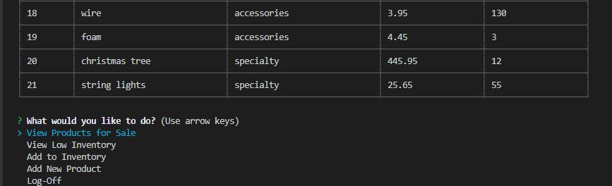

# bamazon

## Overview
A CLI App (Command Line Application) which resembles an online storefront. The App accomplishes two things:
1. Customer View: allows user (Customer) to browse and puchase from the product list.
1. Manager View: allows user (Manager) to view and modify the product list.

## Customer View
* A product list is displayed with the following information:
    * item-id
    * product name
    * department name
    * price
    * quantity available

* The app will prompt the user to:
    * Select the ID of the product they would like to purchase or an option to "Quit" and exit the app if the user decides not to continue.
    * If an item was selected, the user will be asked to enter the quantity of the item they would like to purchase.

* The app will validate the request and inform the user whether the purchase was successful or invalid. If the request is valid, user will be informed that the item and quantity requested is being added to their order.

* After each valid request, user will be asked if they would like to "Keep shopping" or "Checkout":
    * Keep shopping: A new product list with updated inventory will be displayed allowing the user to continue with shopping.
    * Checkout: The order placed by the user will be displayed to include product name, quantity requested and a total price for the order.

## How It Works:
1. Enter "node" + file name in the terminal/console.
1. Product list will display as a table if you are successfully connected to the database.

    * A database is utilized to store data for the product table and updated after each valid request.

1. You will be prompted to select an item to purchase or to quit.
1. After an item number is selected, you will be prompted to enter the quantity you would like to purchase. If the request is successful, you will see a message verifying your purchase and then you will be asked whether you would like to "Keep shopping" or "Checkout".

    * Requests are validated based on whether the item requested is a valid ID number and the quantity requested is available.

1. Choosing to "Keep shopping" will display a new product list with updated inventory. (Notice the inventory for silk ribbons decreased by 3.)

1. Choosing to "Checkout" will display your order, the total for your order, and exits the app.

## Additional Features
*Quit Option:*

You have the option to quit instead of selecting an item to purchase. The order list will still be displayed.

Image of quitting without placing an order:

Image of quitting after order was placed:

*Validation*

If you type in the name of the item instead of the ID number, or the ID number is not on the product list, you will be informed that your entry is not valid and prompted to re-enter the ID number.

Quantities need to be entered as a numeric value to proceed. If quantity entered is "0" or higher than the inventory, the user will be notified that the quantity entered is not valid and be returned to make a new selection or to quit.

## Manager View
* The app will prompt the user to select one of the options:
    * View Products for Sale
    * View Low Inventory
    * Add to Inventory
    * Add New Product
    * Log-Off

* After each task is completed, the user be prompted to choose another task.

## How It Works:
1. Enter "node" + file name in the terminal/console.

1. View Products for Sale: Allows user to see the entire product list.

1. View Low Inventory: A product list with inventory count lower than five will be displayed.

1. Add to Inventory: A series of prompts will assist user in adding to the existing inventory and disply the new inventory count.

1. Add New Product: A series of prompts will assist user in adding a new product to the product list.

    * Selecting "Products for Sale" after adding a new product will allow user to verify that the new product was added correctly.

1. Log-Off: allows user to disconnect from the app.

## Link to Github
[Bamazon](https:https://github.com/cftgithub/bamazon)

## Technologies Used
* Javscript
* Node.js
* MySQL Workbench
* Wampserver

## NPM Packages Used
* Inquirer
* Mysql
* Cli-table

## Future Developments
* Supervisor View:
    * Feature includes:
        * Ability to view product sales by department to include overhead costs and total profit
        * Ability to create new department